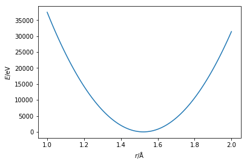

---
redirect_from:
  - "/classical-methods/bonds"
interact_link: content/classical_methods/bonds.ipynb
title: 'Bonds'
prev_page:
  url: /classical_methods/coulomb
  title: 'Charged interactions'
next_page:
  url: /parameterisation/intro
  title: 'Parameterisation'
comment: "***PROGRAMMATICALLY GENERATED, DO NOT EDIT. SEE ORIGINAL FILES IN /content***"
---

# Bonds

Tha ability to simulate atoms interacting through the van der Waals and charged interactions is useful for the study of non-covalent materials. 
However, to truely probe the chemistry of a system we must also be able to model the bonded interactions. 

The potential energy of the bonded interactions of a system is usually made up of bonds, angles, dihedrals, and other higher order processes,

$$ E_{\text{bonded}} = E_{\text{bond}}(\mathbf{r}) + E_{\text{angle}}(\theta) + E_{\text{dihedral}}(\phi) + \ldots . $$

We will focus just on the first two, more information about the higher order processes can be found in relevent textbooks. 
The bond lengths are typically modelled with a harmonic potential energy function, 

$$ E_{\text{bond}}(\mathbf{r}) = \frac{K_b}{2}(\mathbf{r} - b_0)^2, $$

where, $b_0$ is the equilibrium bond length and $K_b$ is the force constant for the bond. 
These must be determined (see [Parameterisation](http://pythoninchemistry.org/sim_and_scat/parameterisation/intro)), and $\mathbf{r}$ is the distance between the two bonded particles. 
An example of this function can be seen below, using the parameters of a carbon-carbon bond.


{:.input_area}
```python
%matplotlib inline
import numpy as np
import matplotlib.pyplot as plt

def bonded(kb, b0, r):
    """
    Calculation of the potential energy of a bond.
    
    Parameters
    ----------
    kb: float
        Bond force constant (units: eV/Å)
    b0: float 
        Equilibrium bond length (units: Å)
    r: float
        Distance between two atoms
    
    Returns
    float
        Energy of the bonded interaction
    """
    return kb / 2 * (r - b0) ** 2

r = np.linspace(1, 2, 100)
plt.plot(r, bonded(274965.16, 1.522, r))
plt.xlabel(r'$r$/Å')
plt.ylabel(r'$E$/eV')
plt.show()
```


{:.output .output_png}



The potential energy of an angle between two atoms that are separated by a third is modeled with a similar harmonic function, 

$$ E_{\text{angle}}(\theta) = \frac{K_\theta}{2}(\theta - \theta_0)^2, $$

where, $\theta$ is the measured angle, $K_\theta$ is the force constant for the harmonic well, and $\theta_0$ is the equilibrium angle size. 
This has the same shape as the bond potential energy curve shown above.

Activate the interactive MyBinder environment (by clicking the "Interact" button at the top). 
This will allow the code cell below to be run. 
This simulation shows a single diatomic molecule interacting through a bond, you can vary the temperature of the simulation and observe how the bond vibration changes. 


{:.input_area}
```python
import bond
%matplotlib notebook
bond.simulation(300)
```


For the sake of simplicity, the remainder of this resource will only focus on non-bonded interactions. 
However, it is important to be aware that all aspects mentioned are **equally applicable** to bonded interactions.
