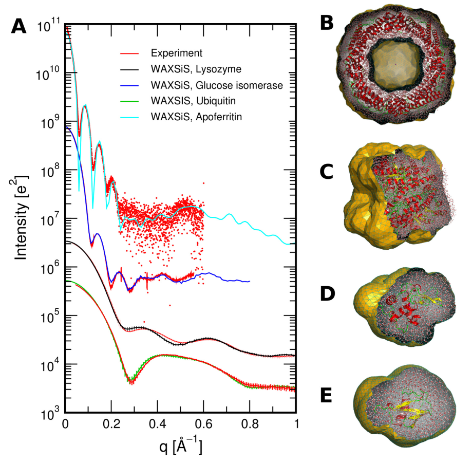

# The interaction between simulation and scattering

**Classical molecular dynamics** (MD) is a common computational chemistry technique for studying complex systems, such as proteins, polymers, and energy materials [[1-4](#references)].
More and more molecular dynamics simulation is being used to aid in the analysis of experimental data from **elastic-scattering techniques**, such as small angle scattering or diffraction [[5-12](#references)].
For example, the figure below is from the work of Knight and Hub [[13](#references)], showing the agreement between experimental data and that determined from simulation for a series of biomolecules.
However, few users of these scattering technique have formal training in classical simulation, which often leads to their use with a full understanding of some of the complexities and subtleties.
Therefore this open learning module aims ot provide an accessible route for users of scattering techniques to understand the methodology of molecular dynamics simulation, some of the pitfalls, and understand how scattering data may be obtained from simulation.
We hope that this will increase those confident to use classical simulation to understand their experimental data, while improving the quality of analysis.

     
     
    <i>Figure 1. (A) SWAXS curves for a number of proteins compared with experimental data, (B) Apoferritin, (C) glucose isomerase, (D) lysozyme, (E) ubiquitin.</i>
      

This tutorial begins with an introduction to classical simulation methods, including a discussion of the development and parameterisation of classical interatomic potential models. We then provide an outline of traditional MD simulation methods and discuss a number of important considerations users of MD simulation should be aware of. We close this tutorial with an illustrative practical example, using the open-source Lennard-Jones simulation package [`pylj`](http://pythoninchemistry.org/pylj) [[14,15](#references)], and discuss how a radially averaged scattering profile may be obtained **directly from simulation** via the Debye equation [[16](#references)].

We wish to emphasise that this tutorial is in **no way** a complete course on classical simulation or MD, and would direct the interested reader to one of the many detailed textbooks on this subject [[17-21](#references)]. Rather, it is our hope that this tutorial provides a simple, practical, and a **general introduction to new, or future, users of MD methods within the scattering community**.

## Prerequisites

To get the most from this tutorial you will need:

- Some basic understanding of the Python programming language (a great source for learning some Python is [pythoninchemistry.org](http://pythoninchemistry.org))
- Some knowledge of undergraduate chemistry or physics is required to fully appreciate the nature of classical potential models
- A commensurate understanding of mathematics

## Using this resource

This resource is designed to be interactive, which is achieved using [Thebelab](https://github.com/minrk/thebelab) and [BinderHub](https://binderhub.readthedocs.io/en/latest/) integration.
Each page that contains interactive content will have the following two buttons at the top,

Selecting the "Interact" button will open a Jupyter Notebook version of the page running on the [MyBinder](https://mybinder.org) resource in a new tab.
The "Thebelab" button will make the code blocks in the webpage interactive, such that they can be run, edited, and re-run.
The Thebelab integration is still in *beta* and therefore will not work perfectly every time (it is known not to work for the pylj examples).
When the Thebelab integration fails, please use the Interact button.

If you use the "Interact" button, please be aware that we are since we are running on a free MyBinder resource, the launching of the Jupyter Notebook may be slow.
We are investigating resources to run our own BinderHub in the future.
Within the Jupyter Notebook in order to run a particular code block, select the cdoe button and click the "Run" button at the top of the page.

If you would prefer to run the resource locally, details of how this can be achieved can be found [here](https://github.com/pythoninchemistry/sim_and_scat/blob/master/content/local.md).

## Code (in)efficiency

Please be aware that the Python code in this tutorial has been written to prioritise understanding, above computational efficiency.
Individual examples may therefore not be the most efficient implementation of particular algorithms.
However, we have endeavoured to provide code examples that are *authentic*, and accurately represent the relevant aspects of *real* molecular dynamics methods.

## Sharing this resource

This is an open educational resource, shared under a [CC BY 4.0 license](./LICENSE.md).
This means that anyone is free to copy and redistribute the resource in any medium or format and welcome to remix, transform, and build upon the material for any purpose, even commercially.
Basically, you can do whatever you want with it, although we would appreciate if you would reference the original resource if you use it.
Please use the reference below, or download it as a [BibTeX file](./sim_and_scat.bib).
> McCluskey, A. R.; Grant, J.; Symington, A. R.; Snow, T.; Doutch, J.; Morgan, B. J.; Parker, S. C.; Edler, K. J. [10.5281/zenodo.2556824](http://doi.org/10.5281/zenodo.2556824)

## Authors

This open educational resource was originally developed by [Andrew R. McCluskey](https://orcid.org/0000-0003-3381-5911) during his Ph.D. at the University of Bath and Diamond Light Source.
The resource benefitted substantially from the hard work and input of the following people:
- [James Grant](https://orcid.org/0000-0003-1362-2055)
- [Adam R. Symington](https://orcid.org/0000-0001-6059-497X)
- [Tim Snow](https://orcid.org/0000-0001-7146-6885)
- James Doutch
- [Benjamin J. Morgan](https://orcid.org/0000-0002-3056-8233)
- [Stephen C. Parker](https://orcid.org/0000-0003-3804-0975)
- [Karen J. Edler](https://orcid.org/0000-0001-5822-0127)

## Acknowledgements

A. R. M. is grateful to the University of Bath and Diamond Light Source for co-funding a studentship (Studentship No. STU0149).
B. J. M. acknowledges support from the Royal Society (Grant No. UF130329).

## References

1. Karplus, M.; McCammon, J. A. *Nat. Struct. Biol.* 2002, **9** (9), 7. [10.1038/nsb0902-646](https://doi.org/10.1038/nsb0902-646).
2. Binder, K. *Monte Carlo and Molecular Dynamics Simulations in Polymer Science*; Oxford University Press: Oxford, 1995.
3. Kim, S.-P.; van Duin, A. C. T.; Shenoy, V. B. *J. Power Sources* 2011, **196** (20), 8590–8597. [10.1016/j.jpowsour.2011.05.061](https://doi.org/10.1016/j.jpowsour.2011.05.061).
4. Burbano, M.; Carlier, D.; Boucher, F.; Morgan, B. J.; Salanne, M. *Phys. Rev. Lett.* 2016, **116** (13). [10.1103/PhysRevLett.116.135901](https://doi.org/10.1103/PhysRevLett.116.135901).
5. Pan, J.; Heberle, F. A.; Tristram-Nagle, S.; Szymanski, M.; Koepfinger, M.; Katsaras, J.; Kučerka, N. *BBA - Biomembranes* 2012, **1818** (9), 2135–2148. [10.1016/j.bbamem.2012.05.007](https://doi.org/10.1016/j.bbamem.2012.05.007).
6. Boldon, L.; Laliberte, F.; Liu, L. *Nano Rev.* 2015, **6** (1), 25661. [10.3402/nano.v6.25661](https://doi.org/10.3402/nano.v6.25661).
7. Hub, J. S. *Curr. Opin. Struct. Biol.* 2018, **49**, 18–26. [10.1016/j.sbi.2017.11.002](https://doi.org/10.1016/j.sbi.2017.11.002).
8. Ivanović, M. T.; Bruetzel, L. K.; Lipfert, J.; Hub, J. S. *Angew. Chemie Int. Ed.* 2018, **57** (20), 5635–5639. [10.1002/anie.201713303](https://doi.org/10.1002/anie.201713303).
9. East, A.; Mechaly, A. E.; Huysmans, G. H. M.; Bernarde, C.; Tello-Manigne, D.; Nadeau, N.; Pugsley, A. P.; Buschiazzo, A.; Alzari, P. M.; Bond, P. J.; et al. *Structure* 2016, **24** (1), 92–104. [10.1016/j.str.2015.10.023](https://doi.org/10.1016/j.str.2015.10.023).
10. Wall, M. E.; van Benschoten, A. H.; Sauter, N. K.; Adams, P. D.; Fraser, J. S.; Terwilliger, T. C. *Proc. Natl. Acad. Sci. U.S.A* 2014, **111** (50), 17887–17892. [10.1073/pnas.1416744111](https://doi.org/10.1073/pnas.1416744111).
11. Wall, M. E. *IUCrJ* 2018, **5** (2), 172–181. [10.1107/S2052252518000519](https://doi.org/10.1107/S2052252518000519).
12. Satoh, M.; Saburi, H.; Tanaka, T.; Matsuura, Y.; Naitow, H.; Shimozono, R.; Yamamoto, N.; Inoue, H.; Nakamura, N.; Yoshizawa, Y.; et al. *FEBS Open Bio.* 2015, **5** (1), 557–570. [10.1016/j.fob.2015.06.011](https://doi.org/10.1016/j.fob.2015.06.011).
13. Knight, C. J.; Hub, J. S. *Nucleic Acids Res.* 2015, **43** (W1), W225–W230. [10.1093/nar/gkv309](https://doi.org/10.1093/nar/gkv309).
14. McCluskey, A. R.; Morgan, B. J.; Edler, K. J.; Parker, S. C. *J. Open Source Educ.* 2018, **1** (2), 19. [10.21105/jose.00019](https://doi.org/10.21105/jose.00019).
15. McCluskey, A. R.; Symington, A. R; Morgan, B. J.; Edler, K. J.; Parker, S. C.. [10.5281/zenodo.2587898](http://doi.org/10.5281/zenodo.2587898).
16. Debye, P. *Ann. Phys.* 1915, **351** (6), 809–823. [10.1002/andp.19153510606](https://doi.org/10.1002/andp.19153510606).
17. Harvey, J. *Computational Chemistry*; Oxford University Press: Oxford, 2018.
18. Grant, G. H.; Richards, W. G. *Computational Chemistry*; Oxford University Press: Oxford, 1995.
19. Leach, A. R. *Molecular Modelling: Principles and Applications*; Addison Wesley London Ltd: Harlow, 1996.
20. Frenkel, D.; Smit, B. *Understanding Molecular Simulation: From Algorithms to Applications*; Academic Press: San Diego, 1996.
21. Allen, M. P.; Tildesley, D. J. *Computer Simulation of Liquids*, 2nd ed.; Oxford University Press: Oxford, 2017.
